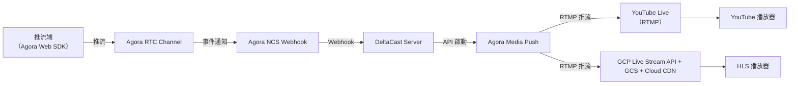

# DeltaCast

[](https://go.dev/)
[](https://nextjs.org/)

一進多出直播中繼系統。直播主透過 Agora RTC 推流至頻道，後端同步將流轉發至 **YouTube Live**（RTMP）與 **Google Cloud Live Stream API**（HLS via Cloud CDN），實現跨平台觀看。

> [!IMPORTANT]
> **POC 限制：單一 Session，無房間概念**
> 本系統目前僅支援**單一活躍 Session**，同一時間只能有一組 `prepare → start → stop` 流程在運作，前端不存在「選擇房間」的邏輯。

---

## 架構概覽



**兩階段流程**：`POST /prepare` 預熱 GCP 與 YouTube 資源（約 30–60 秒）；資源就緒後 `POST /start` 即時回傳 Agora Token，推流立即開始。Agora NCS Webhook 偵測到串流後自動觸發 Media Push。

---

## 目錄結構

| 路徑      | 說明                                         |
| --------- | -------------------------------------------- |
| `server/` | Go 後端 Orchestrator（Gin, 3-layer 架構）    |
| `web/`    | Next.js 16 前端，含推流頁與觀眾頁            |
| `mobile/` | 待開發 iOS（Swift）/ Android（Kotlin）客戶端 |
| `doc/`    | 系統規格、API 文件、任務追蹤                 |
| `script/` | GCP / YouTube 資源管理 Shell Scripts         |

---

## 前置需求

### 工具

| 工具       | 版本    |
| ---------- | ------- |
| Go         | 1.26+   |
| Node.js    | 22 LTS+ |
| pnpm       | 10+     |
| Docker     | 24+     |
| gcloud CLI | latest  |

### 外部帳號

| 服務        | 需求說明                                                                                     |
| ----------- | -------------------------------------------------------------------------------------------- |
| **Agora**   | App ID + App Certificate、REST API 金鑰、NCS Webhook 設定（RTC Channel Events & Media Push） |
| **GCP**     | 啟用 Live Stream API、GCS Bucket（CORS + 公開讀取）、Cloud CDN + Cloud Armor Backend Service |
| **YouTube** | 啟用 Data API v3、頻道開通直播功能（需審核約 24 小時）、OAuth 2.0 憑證 + Refresh Token       |

---

## 快速啟動

### 1. 設定環境變數

```bash
cp server/.env.example server/.env
# 填入 Agora、GCP、YouTube 等金鑰
```

### 2. 全端啟動（建議）

```bash
make docker-up
```

### 3. 個別開發

```bash
make run        # 僅啟動後端 (port 8080)
make web-dev    # 僅啟動前端 (port 3000)
```

### 常用指令

| 指令               | 說明                        |
| ------------------ | --------------------------- |
| `make test`        | 執行後端單元測試            |
| `make docker-logs` | 追蹤 Docker 容器日誌        |
| `make docker-down` | 停止並移除容器              |
| `make gcp-status`  | 檢查 GCP CDN / GCS 狀態     |
| `make res-open`    | 開放 GCP + YouTube 資源存取 |
| `make res-close`   | 鎖定 GCP + YouTube 資源存取 |
| `make clean`       | 清除建置產出                |

---

## 環境變數說明

所有環境變數定義於 [`server/.env.example`](server/.env.example)，分為四類：

| 類別         | 變數前綴                      |
| ------------ | ----------------------------- |
| 伺服器 / JWT | `SERVER_*`, `JWT_*`, `CORS_*` |
| Agora        | `AGORA_*`                     |
| GCP          | `GCP_*`                       |
| YouTube      | `YOUTUBE_*`                   |

---

## API 端點

| Method | Path                | 驗證       | 說明                              |
| ------ | ------------------- | ---------- | --------------------------------- |
| `POST` | `/v1/live/prepare`  | JWT        | 非同步預熱 GCP + YouTube 資源     |
| `POST` | `/v1/live/start`    | JWT        | 回傳 Agora Token，開始推流        |
| `POST` | `/v1/live/stop`     | JWT        | 停止中繼，清理所有資源            |
| `GET`  | `/v1/live/status`   | JWT        | 查詢 Session 狀態與播放 URL       |
| `POST` | `/v1/webhook/agora` | Agora 簽章 | Agora NCS 回呼（觸發 Media Push） |

詳細請求 / 回應格式見 [doc/api/api.md](doc/api/api.md)。

---

## 資源管理

> [!WARNING]
> GCP Live Stream API 資源**按時計費**，開發測試完成後請務必執行 `make res-close` 或 `make docker-down` → `POST /v1/live/stop` 清理資源。

```bash
make res-status       # 查看 GCP + YouTube 資源狀態
make res-open         # 開放存取（IP 限制）
make res-open-public  # 開放存取（無 IP 限制）
make res-close        # 鎖定所有外部存取
```

---

## 文件索引

| 文件                                                                           | 說明                            |
| ------------------------------------------------------------------------------ | ------------------------------- |
| [doc/spec.md](doc/spec.md)                                                     | 系統架構規格與技術決策          |
| [doc/instruction.md](doc/instruction.md)                                       | 實作細節與開發指引              |
| [doc/api/api.md](doc/api/api.md)                                               | API 端點詳細規格                |
| [doc/task-tracking.md](doc/task-tracking.md)                                   | 任務進度追蹤                    |
| [doc/agora/media-push-rest-api.md](doc/agora/media-push-rest-api.md)           | Agora Media Push REST API 參考  |
| [doc/agora/media-push-notifications.md](doc/agora/media-push-notifications.md) | Agora NCS 通知事件說明          |
| [doc/agora/rtc-channel-event-types.md](doc/agora/rtc-channel-event-types.md)   | Agora RTC 頻道事件類型          |
| [doc/setup/agora-setup.md](doc/setup/agora-setup.md)                           | Agora 帳號與專案設定步驟        |
| [doc/setup/gcp-setup.md](doc/setup/gcp-setup.md)                               | GCP 資源建立步驟                |
| [doc/setup/youtube-setup.md](doc/setup/youtube-setup.md)                       | YouTube Data API 與直播設定步驟 |

### CI/CD

| 檔案                                                                           | 說明                                          |
| ------------------------------------------------------------------------------ | --------------------------------------------- |
| [.github/workflows/backed-workflow.yml](.github/workflows/backed-workflow.yml) | 後端 CI/CD：測試 → Build & Push image 至 GHCR |

---

## 專案狀態

目前為 **POC 階段**，Phase 1–3（基礎設施設定、後端、前端）已完成，Phase 4（Mobile 客戶端）尚未開發。詳見 [doc/task-tracking.md](doc/task-tracking.md)。
