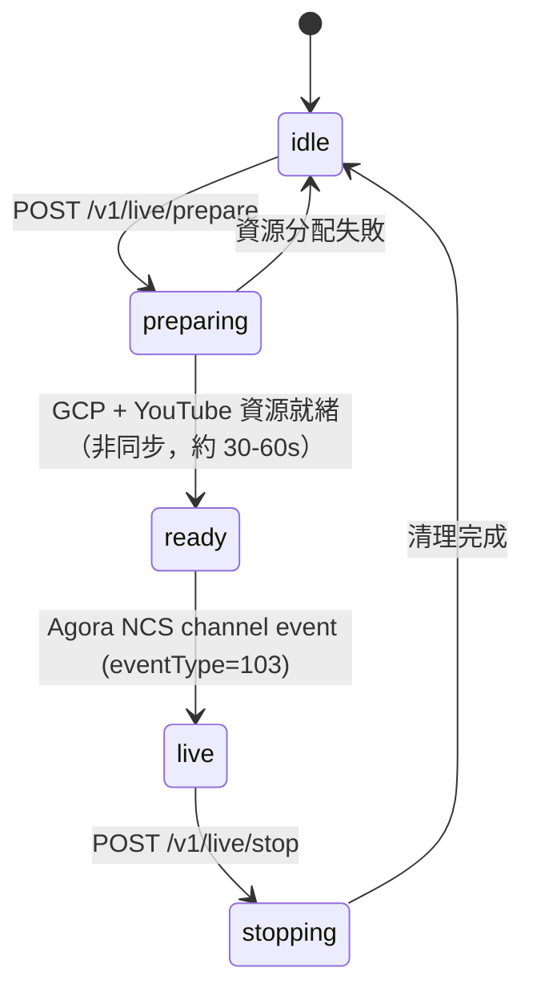
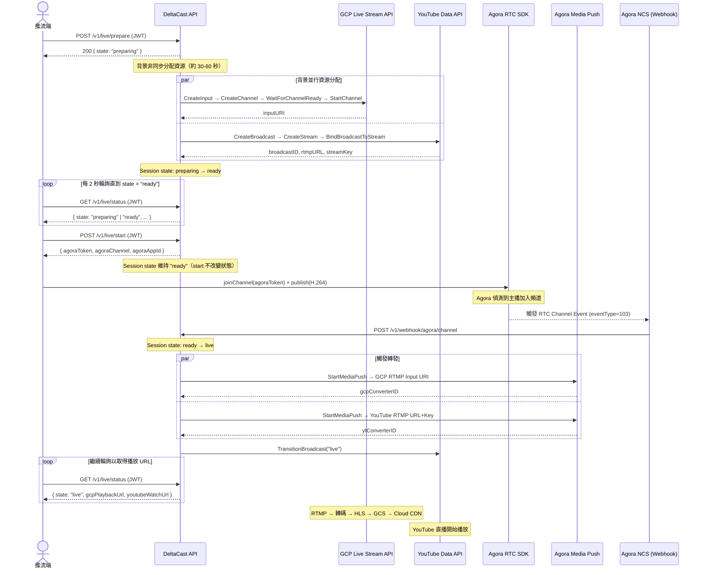
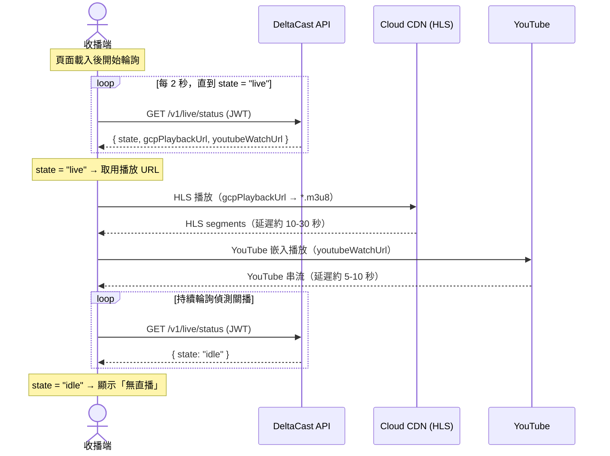
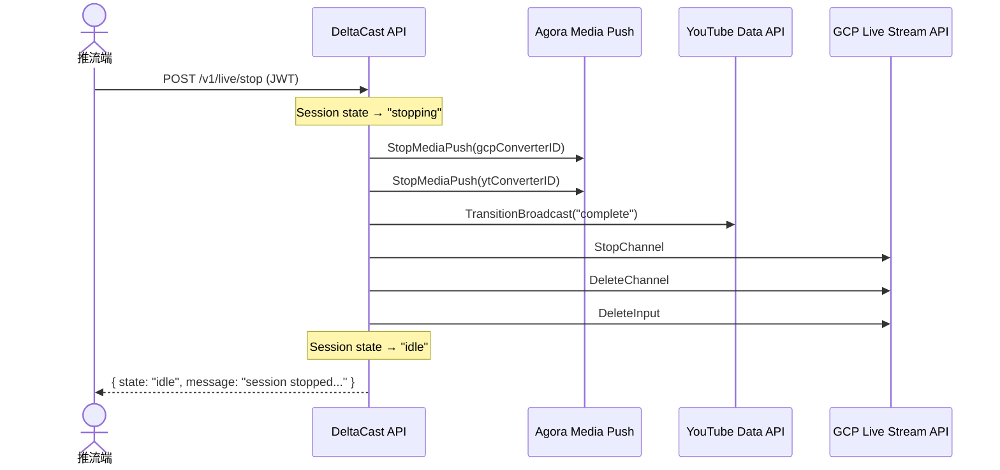

# DeltaCast API 文件

## 概觀

DeltaCast 是一個「一進多出」直播轉發系統。推流端透過 Agora RTC 推流，後端協調將串流轉發至 YouTube（RTMP）與 Google Cloud Live Stream API（HLS via Cloud CDN）。

---

## 認證

除 Webhook 端點外，所有 API 請求必須在 Header 帶上 JWT Bearer Token：

```
Authorization: Bearer <JWT>
```

JWT 使用 **HS256** 演算法簽發，secret 對應環境變數 `JWT_SECRET`。  
Webhook 端點不需要 JWT，改用 **Agora HMAC/SHA1 簽章驗證**（`Agora-Signature` Header）。

---

## Session 狀態機



| 狀態        | 說明                                        |
| ----------- | ------------------------------------------- |
| `idle`      | 無活躍 Session                              |
| `preparing` | GCP 與 YouTube 資源建立中（背景非同步執行） |
| `ready`     | 資源就緒，等待推流                          |
| `live`      | 串流進行中                                  |
| `stopping`  | 資源清理中                                  |

---

## API 端點

### POST `/v1/live/prepare`

預熱 GCP 與 YouTube 資源。立即回傳，資源分配在背景非同步執行（約 30–60 秒）。

**認證**：JWT Bearer Token 必填

**Request Body**：無

**Response `200 OK`** — 新建 Session：

```json
{
  "sessionId": "a1b2c3d4",
  "state": "preparing",
  "message": "resource allocation started, poll /v1/live/status for updates"
}
```

**Response `200 OK`** — Session 已存在（非 `idle`），回傳現有狀態：

```json
{
  "sessionId": "a1b2c3d4",
  "state": "ready",
  "message": "session already exists"
}
```

**Response `500 Internal Server Error`**：

```json
{
  "error": "prepare_failed",
  "message": "<錯誤描述>"
}
```

**後台非同步行為**

並行執行以下兩個 goroutine：

| 任務    | 步驟                                                                     |
| ------- | ------------------------------------------------------------------------ |
| GCP     | `CreateInput` → `CreateChannel` → `WaitForChannelReady` → `StartChannel` |
| YouTube | `CreateBroadcast` → `CreateStream` → `BindBroadcastToStream`             |

兩者皆成功 → Session 狀態轉為 `ready`；任一失敗 → Session 狀態回到 `idle`，需重新呼叫 prepare。

---

### POST `/v1/live/start`

取得 Agora Token。Session 必須為 `ready` 狀態（透過 `GET /v1/live/status` 輪詢確認後呼叫）。

> **重要**：此端點**不改變** Session 狀態。呼叫後 Session 仍維持 `ready`，前端使用取得的 Token 加入 Agora 頻道並推流，Agora 偵測到主播加入後才會透過 NCS Webhook（`eventType=103`）通知後端，後端才將狀態轉為 `live`。

**認證**：JWT Bearer Token 必填

**Request Body**：無

**Response `200 OK`**：

```json
{
  "sessionId": "a1b2c3d4",
  "agoraAppId": "your-agora-app-id",
  "agoraChannel": "deltacast-a1b2c3d4",
  "agoraToken": "<Dynamic RTC Token>",
  "agoraUid": 0
}
```

**Response `400 Bad Request`** — Session 狀態不符：

```json
{
  "error": "start_failed",
  "message": "session is in preparing state, must be ready to start"
}
```

**行為說明**：

- 僅產生 Agora RTC Token，不分配任何 GCP/YouTube 資源，**不改變 Session 狀態**
- 若 Session 已為 `live`，重複呼叫會回傳新 Token（不重複建立資源）
- Token TTL：86400 秒（24 小時）
- `agoraUid` 固定為 `0`（由 Agora 自動分配）

---

### POST `/v1/live/stop`

停止直播並依序釋放所有資源。各步驟失敗只 log，不中斷後續清理。

**認證**：JWT Bearer Token 必填

**Request Body**：無

**Response `200 OK`** — 正常停止：

```json
{
  "sessionId": "a1b2c3d4",
  "state": "idle",
  "message": "session stopped, all resources cleaned up"
}
```

**Response `200 OK`** — 無活躍 Session：

```json
{
  "sessionId": "",
  "state": "idle",
  "message": "no active session"
}
```

**Response `500 Internal Server Error`**：

```json
{
  "error": "stop_failed",
  "message": "<錯誤描述>"
}
```

**清理順序（每步失敗皆 log 並繼續）**：

| 步驟 | 動作                                            |
| ---- | ----------------------------------------------- |
| 1    | 停止 Agora Media Push Converter（GCP 目標）     |
| 2    | 停止 Agora Media Push Converter（YouTube 目標） |
| 3    | YouTube Broadcast 轉為 `complete`               |
| 4    | 停止 GCP Channel                                |
| 5    | 刪除 GCP Channel                                |
| 6    | 刪除 GCP Input                                  |
| 7    | Session 狀態重設為 `idle`                       |

---

### GET `/v1/live/status`

查詢當前 Session 狀態與播放 URL。

**認證**：JWT Bearer Token 必填

**Response `200 OK`**：

```json
{
  "sessionId": "a1b2c3d4",
  "state": "live",
  "gcpPlaybackUrl": "https://<cdn-domain>/channel-a1b2c3d4/main.m3u8",
  "youtubeWatchUrl": "https://www.youtube.com/watch?v=<broadcastId>"
}
```

**各狀態下欄位可用性**：

| 狀態 | `gcpPlaybackUrl` | `youtubeWatchUrl` | 有實際內容？ |
|------|-----------------|-------------------|-------------|
| `idle` | 空字串 | 空字串 | 否 |
| `preparing` | 空字串 | 空字串 | 否 |
| `ready` | ✓ 已填入 | ✓ 已填入 | 否（資源就緒但尚未推流）|
| `live` | ✓ 已填入 | ✓ 已填入 | **是** |
| `stopping` | ✓ 已填入 | ✓ 已填入 | 停止中 |

> 收播端只需輪詢此端點，在 `state === "live"` 時取用兩條 URL 即可。因為 POC 單一 Session，不需要額外的房間選擇邏輯。

---

### POST `/v1/webhook/agora/channel`

接收 Agora RTC Channel 事件（NCS，productId=1）。

**認證**：無 JWT；使用 `Agora-Signature` Header 進行 HMAC/SHA1 驗證（對應 `AGORA_CHANNEL_NCS_SECRET`）

**Request Headers**：

```
Agora-Signature: <hmac-sha1-hex>
Content-Type: application/json
```

**Request Body**：

```json
{
  "noticeId": "abc123",
  "productId": 1,
  "eventType": 103,
  "payload": {
    "uid": 12345
  }
}
```

**Response `200 OK`**：

```json
{ "status": "ok" }
```

**Response `401 Unauthorized`** — 簽章驗證失敗：

```json
{
  "error": "unauthorized",
  "message": "invalid webhook signature"
}
```

**處理邏輯**：

- 只處理 `eventType = 103`（主播加入頻道），其他 eventType 直接忽略並回傳 `200`
- 收到 103 後觸發 Agora Media Push 轉發至 GCP RTMP + YouTube RTMP，並呼叫 YouTube Broadcast 轉為 `live`
- **冪等保護**：若 Session 已為 `live`，忽略重複事件

**RTC Channel eventType 對照**：

| eventType | 說明                                |
| --------- | ----------------------------------- |
| 101       | 頻道建立                            |
| 102       | 頻道銷毀                            |
| **103**   | **主播加入頻道（觸發 Media Push）** |
| 104       | 主播離開頻道                        |

---

### POST `/v1/webhook/agora/media-push`

接收 Agora Media Push 事件（NCS，productId=5）。

**認證**：無 JWT；使用 `Agora-Signature` Header 進行 HMAC/SHA1 驗證（對應 `AGORA_MEDIA_PUSH_NCS_SECRET`）

**Request Headers**：

```
Agora-Signature: <hmac-sha1-hex>
Content-Type: application/json
```

**Request Body**：

```json
{
  "noticeId": "abc123",
  "productId": 5,
  "eventType": 3,
  "payload": {
    "converter": {
      "id": "converter-id-xxx",
      "state": "running"
    },
    "destroyReason": ""
  }
}
```

**Response `200 OK`**：

```json
{ "status": "ok" }
```

**Media Push eventType 對照**：

| eventType | 說明                                       |
| --------- | ------------------------------------------ |
| 1         | Converter 已建立                           |
| 2         | Converter 設定變更                         |
| 3         | Converter 狀態變更（`running` / `failed`） |
| 4         | Converter 已銷毀（`destroyReason` 填原因） |

> 目前僅做 log，不觸發額外狀態變更。

---

## 完整流程圖

### 開播流程



### 收播端流程



> **收播端設計重點**：
> - 不需要呼叫 `prepare` / `start` / `stop`，只需 `GET /v1/live/status`
> - JWT Token 與推流端共用同一組（POC 無使用者系統）
> - `gcpPlaybackUrl` 回傳完整 `.m3u8` URL，直接餵給 HLS 播放器（video.js）
> - `youtubeWatchUrl` 格式為 `https://www.youtube.com/watch?v={broadcastId}`，可直接給 YouTube 播放器元件

### 關播流程



---

## 資料模型

### Session（in-memory，`server/internal/model/session.go`）

| 欄位                  | 類型         | 說明                                             |
| --------------------- | ------------ | ------------------------------------------------ |
| `id`                  | string       | 8 碼短 UUID（`uuid.New().String()[:8]`）         |
| `state`               | SessionState | `idle \| preparing \| ready \| live \| stopping` |
| `createdAt`           | time.Time    | Session 建立時間                                 |
| `agoraChannel`        | string       | Agora 頻道名稱，格式：`deltacast-{id}`           |
| `gcpInputID`          | string       | GCP Input 資源 ID                                |
| `gcpChannelID`        | string       | GCP Channel 資源 ID                              |
| `gcpInputURI`         | string       | GCP RTMP Push URI（Agora → GCP）                 |
| `gcpPlaybackURL`      | string       | HLS 播放 URL（Cloud CDN）                        |
| `youtubeBroadcastID`  | string       | YouTube Broadcast ID                             |
| `youtubeStreamID`     | string       | YouTube Stream ID                                |
| `youtubeStreamKey`    | string       | YouTube Stream Key                               |
| `youtubeRtmpURL`      | string       | `{rtmpURL}/{streamKey}`                          |
| `youtubeWatchUrl`     | string       | `https://www.youtube.com/watch?v={broadcastID}`  |
| `mediaPushGcpSid`     | string       | Agora Converter ID（GCP 目標）                   |
| `mediaPushYoutubeSid` | string       | Agora Converter ID（YouTube 目標）               |

### API Response 結構（`server/internal/model/api.go`）

**PrepareResponse**

```json
{ "sessionId": "string", "state": "SessionState", "message": "string" }
```

**StartResponse**

```json
{
  "sessionId": "string",
  "agoraAppId": "string",
  "agoraChannel": "string",
  "agoraToken": "string",
  "agoraUid": 0
}
```

**StopResponse**

```json
{ "sessionId": "string", "state": "SessionState", "message": "string" }
```

**StatusResponse**

```json
{
  "sessionId": "string",
  "state": "SessionState",
  "gcpPlaybackUrl": "string (omitempty)",
  "youtubeWatchUrl": "string (omitempty)"
}
```

**ErrorResponse**

```json
{ "error": "error_code", "message": "human-readable description" }
```

---

## Agora Media Push 模式

| 模式                  | 環境變數                          | 說明                                                               |
| --------------------- | --------------------------------- | ------------------------------------------------------------------ |
| **Raw Relay（預設）** | `AGORA_TRANSCODING_ENABLED=false` | 直接轉發原始串流，不重新編碼，成本最低；推流端須輸出 H.264/AAC     |
| **轉碼模式**          | `AGORA_TRANSCODING_ENABLED=true`  | H.264 High + AAC LC，720p / 30fps / 2500kbps video + 128kbps audio |

---

## 注意事項

| 項目             | 說明                                                                                     |
| ---------------- | ---------------------------------------------------------------------------------------- |
| **GCP 計費風險** | GCP Live Stream API 按時段計費，Stop 流程每步失敗只 log、不中斷，確保資源完整釋放        |
| **冪等性**       | Agora NCS 可能重複送事件；後端以 Session 狀態檢查是否已處理（`live` 狀態下忽略重複 103） |
| **延遲預期**     | HLS（GCP）約 10–30 秒；YouTube RTMP 約 5–10 秒                                           |
| **單一 Session** | POC 階段僅支援一個活躍 Session，重複呼叫 `prepare` 回傳現有 Session                      |
| **Agora Codec**  | 推流端 Agora RTC SDK 必須使用 `codec: "h264"`，VP8 無法通過 Raw Relay 到 YouTube/GCP     |
