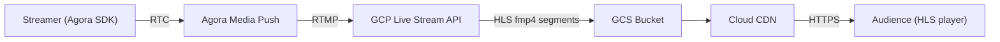

# GCP Live Stream API — 從推流到播放的運作邏輯

## 整體架構



---

## 一、GCP Live Stream API 內部流水線

一個 Channel 的設定分為三層：

```
ElementaryStream（基本串流，一個 codec 一條）
    ├── video-stream  ← H.264 High Profile, 2.5 Mbps, 720p@30fps
    └── audio-stream  ← AAC, 128 kbps, Stereo, 48 kHz
          ↓ 封裝成 fmp4 segment（fmp4 限制：每個 MuxStream 只能含一條 ES）
MuxStream（多工串流，實際寫到 GCS 的分段檔）
    ├── mux-video  →  只含 video-stream
    └── mux-audio  →  只含 audio-stream
          ↓ 索引於
Manifest
    └── main.m3u8  →  HLS 播放清單，同時引用 mux-video + mux-audio
```

### 關鍵參數說明

| 參數                  | 值   | 說明                                                                                              |
| --------------------- | ---- | ------------------------------------------------------------------------------------------------- |
| `GopDuration`         | 2 s  | GOP（Group of Pictures）長度，必須和 `SegmentDuration` 相等，確保每個 segment 開頭都是 IDR 關鍵幀 |
| `SegmentDuration`     | 2 s  | 每個 `.m4s` 分段的時長；值越小延遲越低，但 CDN 請求頻率越高                                       |
| `MaxSegmentCount`     | 5    | HLS playlist 中保留的 segment 數量，形成滑動視窗（5 × 2s = 10s 視窗）                             |
| `SegmentKeepDuration` | 60 s | GCS 上保留 segment 檔案的時間，讓網路較慢的播放器仍能取得稍早的 segment                           |

> **為何 GOP = Segment？**  
> HLS 播放器在切換 segment 時不會跨 segment 解碼。若 segment 開頭不是關鍵幀，播放器需要往前找到上一個 IDR 才能開始解碼，造成延遲或花屏。讓 GOP 對齊 segment 邊界可完全避免此問題。

---

## 二、GCS 輸出結構

Channel 啟動後，GCP 會持續向 GCS bucket 寫入以下檔案：

```
gs://<bucket>/<channelID>/
    ├── main.m3u8              ← HLS Master Playlist（播放器入口）
    ├── mux-video/
    │   ├── segment-000001.m4s
    │   ├── segment-000002.m4s
    │   └── ...
    └── mux-audio/
        ├── segment-000001.m4s
        ├── segment-000002.m4s
        └── ...
```

`main.m3u8` 是一個 **Multi-variant (Master) Playlist**，內含對 `mux-video` 和 `mux-audio` 子 playlist 的參照。播放器解析後，會同時拉取視訊和音訊的 segment，在本地合併播放。

---

## 三、Cloud CDN 與播放 URL

GCS bucket 掛載在 Cloud CDN 後端，播放 URL 格式如下：

```
https://<CDN_DOMAIN>/<channelID>/main.m3u8
```

CDN 會快取 segment 檔案，減少直接打到 GCS 的流量，並提供全球邊緣節點加速播放。

> CDN domain 由環境變數 `GCP_CDN_DOMAIN` 設定，對應 `GetPlaybackURL()` 回傳值。

---

## 四、Channel 生命週期

```
CreateInput  ──►  CreateChannel  ──►  StartChannel  ──►  WaitForChannelReady
                                                               │
                                                               ▼
                                                        AWAITING_INPUT
                                                               │  (Agora Media Push 開始推 RTMP)
                                                               ▼
                                                           STREAMING  ──►  觀眾可播放
                                                               │
                                                        StopChannel
                                                               │
                                                        DeleteChannel
                                                        DeleteInput
```

### 狀態說明

| 狀態             | 說明                               |
| ---------------- | ---------------------------------- |
| `AWAITING_INPUT` | Channel 已啟動，等待 RTMP 推流進入 |
| `STREAMING`      | 正在接收 RTMP 並輸出 HLS segment   |

`WaitForChannelReady()` 會輪詢直到進入上述任一狀態（timeout: 120s）。

---

## 五、資源清理

GCP 資源**按時計費**，stop flow 必須依序執行以下清理，且每步驟失敗時記錄錯誤並繼續執行，不可中止：

1. `StopChannel` — 停止轉碼，停止向 GCS 寫入
2. `DeleteChannel` — 刪除 channel 設定
3. `DeleteInput` — 刪除 RTMP input 端點
4. 清除 GCS bucket 內該 channelID 下的所有 segment 檔案（由 service 層處理）

---

## 六、延遲估算

```
Agora RTC 延遲       ~100–300 ms
Agora → GCP RTMP    ~200–500 ms
GCP 轉碼 + 封裝      ~500 ms–1 s
SegmentDuration      2 s
MaxSegmentCount 視窗  10 s（播放器通常從最新的 3 個 segment 開始播）
CDN 傳輸             ~50–200 ms

估計端到端延遲：約 6–15 秒（HLS 本質上的 chunk-based 延遲）
```

若需要更低延遲，可考慮 **LL-HLS（Low-Latency HLS）** 或改用 **CMAF with chunked transfer**，但需要播放器端支援。
