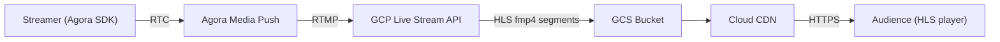
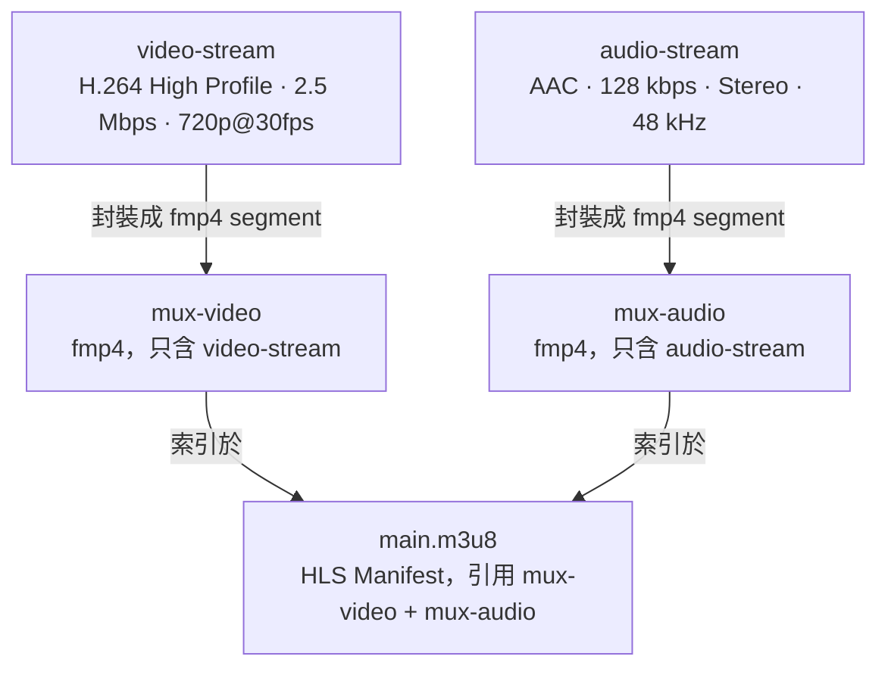
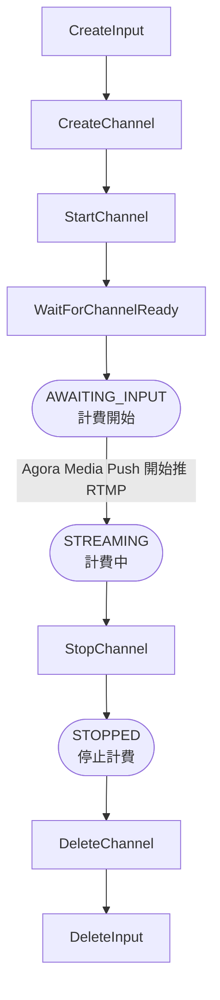

# GCP Live Stream API — 從推流到播放的運作邏輯

## 整體架構



---

## 一、GCP Live Stream API 內部流水線

一個 Channel 的設定分為三層：



> fmp4 限制：每個 MuxStream 只能含一條 ElementaryStream，因此視訊與音訊必須拆為兩個 MuxStream。

### 關鍵參數說明

| 參數                  | 值   | 說明                                                                                              |
| --------------------- | ---- | ------------------------------------------------------------------------------------------------- |
| `GopDuration`         | 2 s  | GOP（Group of Pictures）長度，必須和 `SegmentDuration` 相等，確保每個 segment 開頭都是 IDR 關鍵幀 |
| `SegmentDuration`     | 2 s  | 每個 `.m4s` 分段的時長；值越小延遲越低，但 CDN 請求頻率越高                                       |
| `MaxSegmentCount`     | 5    | HLS playlist 中保留的 segment 數量，形成滑動視窗（5 × 2s = 10s 視窗）                             |
| `SegmentKeepDuration` | 60 s | GCS 上保留 segment 檔案的時間，讓網路較慢的播放器仍能取得稍早的 segment                           |

> **為何 GOP = Segment？**  
> HLS 播放器在切換 segment 時不會跨 segment 解碼。若 segment 開頭不是關鍵幀，播放器需要往前找到上一個 IDR 才能開始解碼，造成延遲或花屏。讓 GOP 對齊 segment 邊界可完全避免此問題。

---

## 二、GCS 輸出結構

Channel 啟動後，GCP 會持續向 GCS bucket 寫入以下檔案：

```
gs://<bucket>/<channelID>/
    ├── main.m3u8              ← HLS Master Playlist（播放器入口）
    ├── mux-video/
    │   ├── segment-000001.m4s
    │   ├── segment-000002.m4s
    │   └── ...
    └── mux-audio/
        ├── segment-000001.m4s
        ├── segment-000002.m4s
        └── ...
```

`main.m3u8` 是一個 **Multi-variant (Master) Playlist**，內含對 `mux-video` 和 `mux-audio` 子 playlist 的參照。播放器解析後，會同時拉取視訊和音訊的 segment，在本地合併播放。

---

## 三、Cloud CDN 與播放 URL

GCS bucket 掛載在 Cloud CDN 後端，播放 URL 格式如下：

```
https://<CDN_DOMAIN>/<channelID>/main.m3u8
```

CDN 會快取 segment 檔案，減少直接打到 GCS 的流量，並提供全球邊緣節點加速播放。

> CDN domain 由環境變數 `GCP_CDN_DOMAIN` 設定，對應 `GetPlaybackURL()` 回傳值。

---

## 四、Channel 生命週期



### 狀態說明

| 狀態             | 說明                               | 計費狀態   |
| ---------------- | ---------------------------------- | ---------- |
| `AWAITING_INPUT` | Channel 已啟動，等待 RTMP 推流進入 | **計費中** |
| `STREAMING`      | 正在接收 RTMP 並輸出 HLS segment   | **計費中** |
| `STOPPED`        | Channel 已停止，等待刪除或重新啟動 | 不計費     |
| `STOPPING`       | 停止中（LRO 進行中）               | 不計費     |

`WaitForChannelReady()` 會輪詢直到進入 `AWAITING_INPUT` 或 `STREAMING` 狀態（timeout: 120s）。

> **重要**：`AWAITING_INPUT` 就算沒有任何推流輸入也會持續計費。Channel 建立後必須在用完按時將其完整刪除。

---

## 五、計費機制

> Source: <https://cloud.google.com/livestream/pricing>（查閱日期：2026-03-03）

### 計費觸發點

- 計費從 **`StartChannel`** 呼叫後開始，直到 channel 進入 `STOPPED` 或 `STOPPING` 狀態才停止。
- **Channel 狀態不是 `STOPPED`/`STOPPING` 就計費**，包含 `AWAITING_INPUT`（無推流輸入也計費）。
- 超出 10 分鐘後以分鐘為單位向上取整。
- **每次 StartChannel 至少計費 10 分鐘**（最低收費），無論實際使用時間。

### DeltaCast 每個 Session 的計費組成（asia-east1）

| 資源類型 | 規格                 | 單價         |
| -------- | -------------------- | ------------ |
| Input    | HD (1280×720, H.264) | $0.14/hr     |
| Output   | HD H.264 `mux-video` | $0.45/hr     |
| Output   | HD H.264 `mux-audio` | $0.45/hr     |
| **小計** | 1 input + 2 outputs  | **$1.04/hr** |

> 注：`mux-audio` 僅含音訊，但 GCP 依輸出 stream 的**設定解析度**計費。因 `mux-video` 設定為 720p, `mux-audio` 為純音訊 mux—實際計費被归類為 HD + SD，總額可能略不同。正確計算請依 [GCP 定價頁](https://cloud.google.com/livestream/pricing) 假定輸入 / 輸出 tier 對照。

### 實際事故案例（2026-02-27 至 2026-03-03）

5 個 channel 在 `AWAITING_INPUT` / `STREAMING` 狀態閒置，未被清理：

| Channel            | 宿存時間 | 估算費用      |
| ------------------ | -------- | ------------- |
| `channel-a8b142f2` | ~138 hr  | ~$144         |
| `channel-aecf6d65` | ~73 hr   | ~$76          |
| `channel-78da92ac` | ~73 hr   | ~$76          |
| `channel-9e26cde0` | ~4 hr    | ~$4           |
| `channel-686e665a` | ~4 hr    | ~$4           |
| **合計**           |          | **~$304 USD** |

全部被 GCP 免費積分抗消，實際未收費。造成原因為 server crash 後 in-memory session 消失，且無 orphan recovery 機制。

### 防護機制

| 情境                          | 防護方法                                              |
| ----------------------------- | ----------------------------------------------------- |
| `prepare` 後關瀏覽器沒有 stop | **Watchdog TTL**：`ready` 狀態 5 分鐘自動 stop        |
| 直播中 Agora NCS 事件漏送     | **Watchdog TTL**：`live` 狀態 1 小時自動 stop         |
| Server crash / 重啟           | **Orphan Recovery**：啟動時自動清除非 STOPPED channel |
| GCP 分配成功但 YouTube 失敗   | **錢路修復**：cleanupPartialResources() 正確呼叫      |
| 關閉分頁時 stop 請求被取消    | **keepalive**：fetch 加入 `keepalive: true`           |

---

## 六、資源清理

GCP 資源**按時計費**，stop flow 必須依序執行以下清理，且每步驟失敗時記錄錯誤並繼續執行，不可中止：

1. `StopChannel` — 停止轉碼，停止向 GCS 寫入
2. `DeleteChannel` — 刪除 channel 設定
3. `DeleteInput` — 刪除 RTMP input 端點
4. 清除 GCS bucket 內該 channelID 下的所有 segment 檔案（手動至 GCS Console 刪除，或設定 bucket lifecycle rule 自動清理）

---

## 七、延遲估算

```
Agora RTC 延遲       ~100–300 ms
Agora → GCP RTMP    ~200–500 ms
GCP 轉碼 + 封裝      ~500 ms–1 s
SegmentDuration      2 s
MaxSegmentCount 視窗  10 s（播放器通常從最新的 3 個 segment 開始播）
CDN 傳輸             ~50–200 ms

估計端到端延遲：約 6–15 秒（HLS 本質上的 chunk-based 延遲）
```

若需要更低延遲，可考慮 **LL-HLS（Low-Latency HLS）** 或改用 **CMAF with chunked transfer**，但需要播放器端支援。
