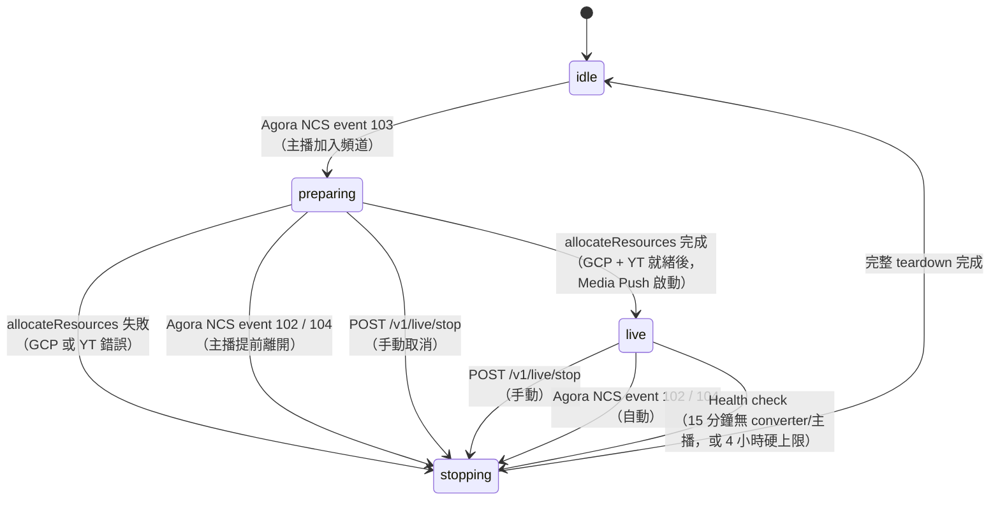
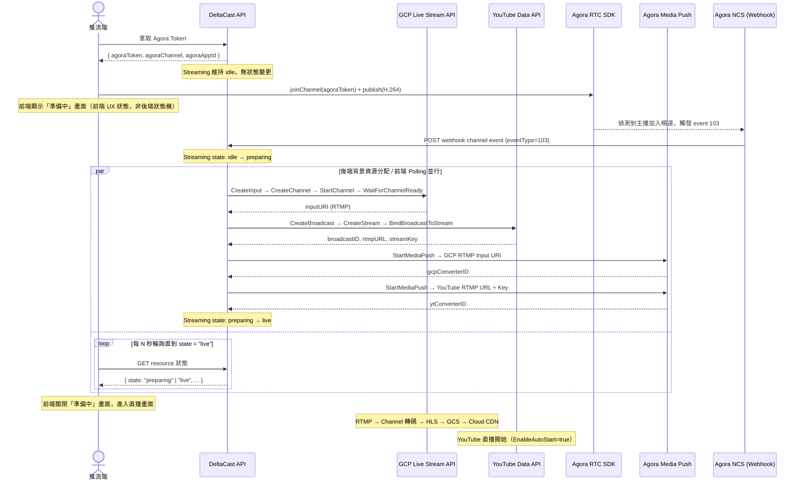
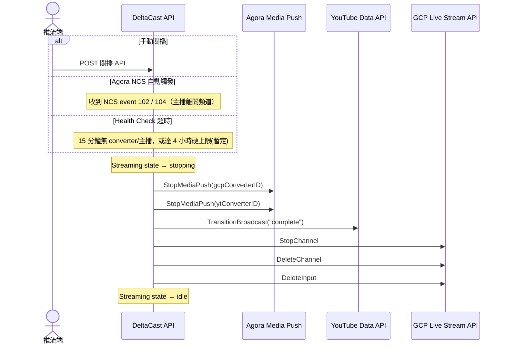

# Product Assumption & Design

> **Declaration**：本文件所有狀態機與流程圖，均以**後端資源分配生命週期**為視角進行描述。部分狀態（如 `preparing`）在Agora層面Streaming已開始，對後端來說正在準備相關資源，但對觀眾或主播而言直播尚未可見，此為設計預期，非矛盾。

## 背景描述

目前 PoC 直播開播流程為三階段式：
1. 前端呼叫 `prepare` API 進行預熱，後端分配 GCP / YouTube 資源
2. 前端輪詢 `status` 狀態，直到完成後才呼叫 `start` API 正式開始直播。
3. 後端啟動 Media Push 將直播串流推送到 GCP / YouTube。

而產品面來說，具有兩種開始直播模式:
- **立即開播**（前端直接 `joinChannel`）
- **預約開播**（前端先設定預計開播時間，等時間到再`joinChannel`），而預定時間前30分鐘，以及後10分鐘內主播可以隨時開始直播

因此，希望後端有一套統一的 Streaming 狀態機，能同時支援兩種模式，並且盡可能簡化前端開播流程。

>- **Streaming 定義**：一次直播事件，包含從前端取得 Token、分配 GCP/YouTube 資源、啟動 Media Push、到關播的完整流程。**PoC 層面等同 Session**。

## 前端開播模型

前端開播流程不再透過後端 `prepare` / `start` 兩階段預熱，而是**直接由 Agora 頻道事件驅動**：

1. **取得 Token**：前端向後端取得 Agora Token。此操作不改變 Streaming 狀態。
2. **加入 Agora 頻道**：前端使用 Token 直接 `joinChannel`，開始推流。
3. **準備中畫面**：前端在加入頻道後即顯示「準備中」畫面。此 UX 狀態純由前端自行管理，**後端 Streaming 狀態在此階段仍為 idle**。
4. **後端接到事件後觸發**：Agora 偵測到主播加入頻道，向後端發送 NCS event 103，後端接收後才開始分配 GCP / YouTube 資源，待資源就緒後啟動 Media Push。

---

### Streaming 狀態機

| 狀態        | 說明                                                                        |
| ----------- | --------------------------------------------------------------------------- |
| `idle`      | 無活躍 Streaming                                                            |
| `preparing` | NCS 103 觸發，GCP 與 YouTube 資源分配中（約 30–60 秒），Media Push 尚未啟動 |
| `live`      | 資源就緒，Media Push 運行中，串流進行中                                     |
| `stopping`  | 資源清理中；手動觸發、NCS 102/104 自動觸發、或 Health Check 超時觸發        |

---

### 開播流程

---

### 關播流程

> **容錯**：Stop 流程每一步驟失敗只 log，不中斷後續清理，確保 GCP 資源完整釋放。

---

### Preparing 期間中斷

若後端在 `preparing` 期間收到中斷訊號（NCS 102/104 或手動 stop），處理機制與 spec 中「Preparing 中途收到 Stop」相同：

1. Streaming state 設為 `stopping`，取消進行中的 allocation context。
2. 快照此時所有已建立的資源 ID（部分可能仍為空）。
3. 同步執行 Stop 清理步驟，資源 ID 為空的步驟依 guard 跳過，幾乎瞬間完成，Streaming 重設為 `idle`。
4. 進行中的 GCP/YouTube API 呼叫因 context 取消提前返回；allocation job 偵測到 `stateStopping`，進入 **partial cleanup**（非同步，60s 新 context）：
   - 嘗試 `StopChannel` → `DeleteChannel` → `DeleteInput`（GCP 404 可忽略）
   - 若 YouTube Broadcast 已建立，呼叫 `TransitionBroadcast("complete")`
   - 以 `streamingID` guard 防止覆蓋後續新建的 Streaming
