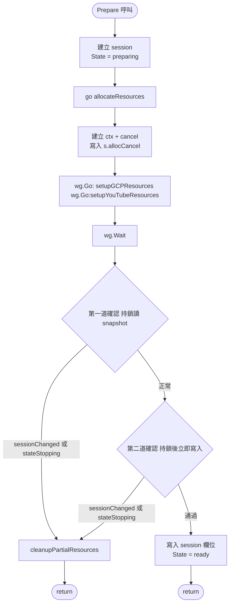
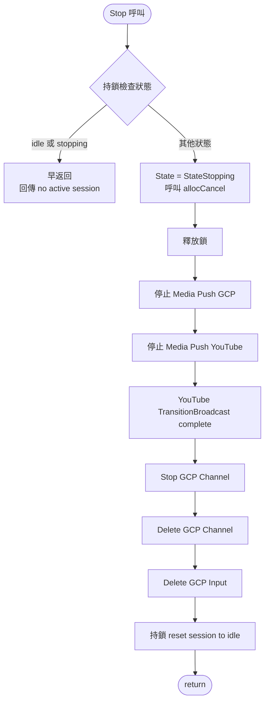
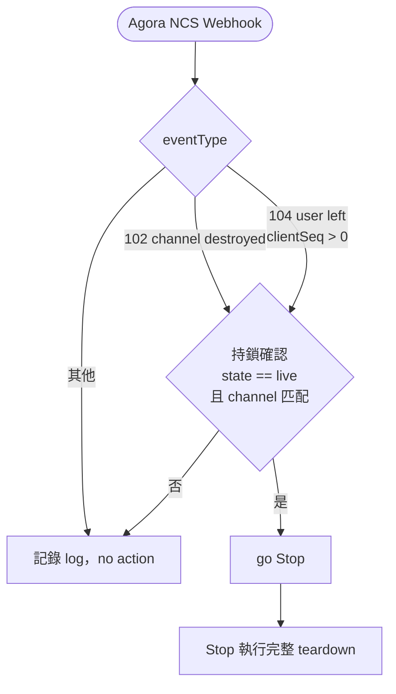

# Session 並發控制與資源清除

本文件說明 `LiveService` 在資源分配（`allocateResources`）與停止（`Stop`）並發執行時，如何透過鎖與雙重確認保證狀態正確轉換、資源不孤兒化。

---

## 狀態機

狀態機定義參見 [doc/spec.md § Session 管理](spec.md)。本文件聚焦在 `preparing → ready / stopping` 與 `live → stopping` 的並發保護細節。

---

## `allocateResources` 流程

### 雙重確認說明

`wg.Wait()` 完成後到 session 寫入之間分兩步驟確認：

| 確認   | 方式                               | 目的                                                   |
| ------ | ---------------------------------- | ------------------------------------------------------ |
| 第一道 | Lock → 讀 snapshot → Unlock        | 快速過濾已明確中斷的情況                               |
| 第二道 | Lock → 確認 → **持鎖直到函式結束** | 消除兩次 Lock 之間的競爭窗口，確保確認與寫入是原子操作 |

第二道確認通過後使用 `defer s.mu.Unlock()`，session 所有欄位在同一個鎖持有期間完成寫入，不存在中間狀態被外部觀察到的可能。

---

## Stop() 流程

**StateStopping 早返回**：`Stop()` 進入後立即將 state 設為 `StateStopping` 並釋放鎖。若後續有其他呼叫方在 teardown 期間再次進入 `Stop()`（如 auto-stop goroutine 與手動 Stop 並發），在鎖內發現 `StateStopping` 即直接返回，確保 teardown 只執行一次。

---

## Auto-Stop：廣播者離線事件

`clientSeq > 0` 用於區分真實廣播者與 Media Push bot：bot 離線的 event 104 其 `clientSeq` 為 0，以此避免 bot 離線誤觸 auto-stop。

Auto-Stop 使用 `go func()` 非同步執行，不阻塞 webhook 回應。`Stop()` 的 `StateStopping` 早返回確保多個 auto-stop goroutine 並發時只有一個實際執行 teardown。

---

## `cleanupPartialResources` Closure

`allocateResources` 中將清除邏輯定義為 closure，有以下特性：

- **使用 goroutine local 變數**（`inputID`、`channelID`、`broadcastID`），不讀取 `s.session` 欄位，確保即使 `Stop()` 已將 session reset，仍能找到正確的資源 ID 執行清除。
- **獨立 context**（60 秒 timeout），不受原本已超時或取消的 allocation ctx 影響。
- **兩個確認路徑共用**：第一道與第二道確認都呼叫同一份邏輯，無重複程式碼。
- **session reset 保護**：closure 結束前持鎖確認 `s.session.ID == sessionID`，只有 session 未被新 Prepare 取代時才 reset，避免清除到下一個 session 的狀態。

---

## 鎖使用原則

| 原則                      | 說明                                                                                    |
| ------------------------- | --------------------------------------------------------------------------------------- |
| 持鎖期間不做 I/O          | 所有 provider 呼叫（GCP / YT / Agora）必須在釋放鎖之後進行                              |
| 最小化持鎖範圍            | 只在讀寫 `s.session` 欄位時持鎖，完成後立即釋放                                         |
| 不在持鎖中呼叫 Stop()     | `Stop()` 本身會取得鎖，在已持鎖的情況下呼叫會造成 deadlock                              |
| Goroutine 使用 local 變數 | 在鎖外啟動的 goroutine 應先將所需 session 欄位 snapshot 為 local 變數，避免持有過期引用 |
