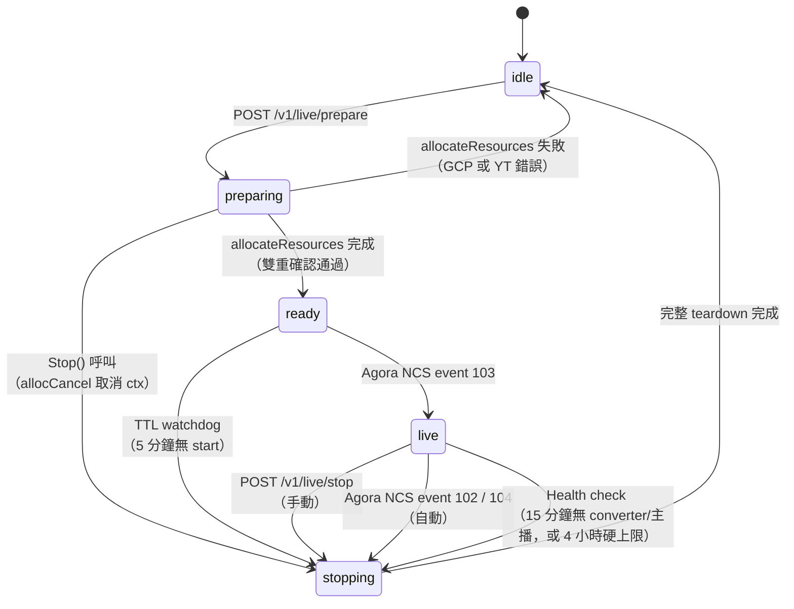
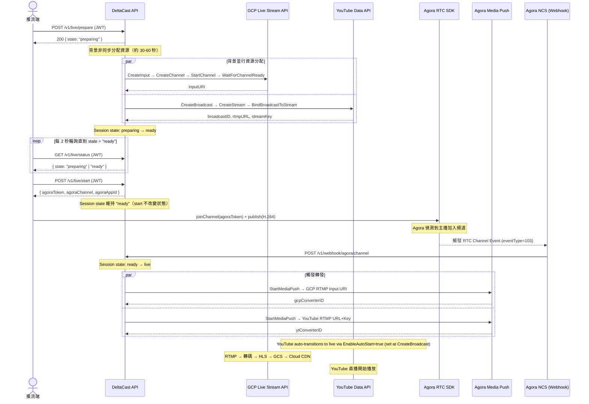
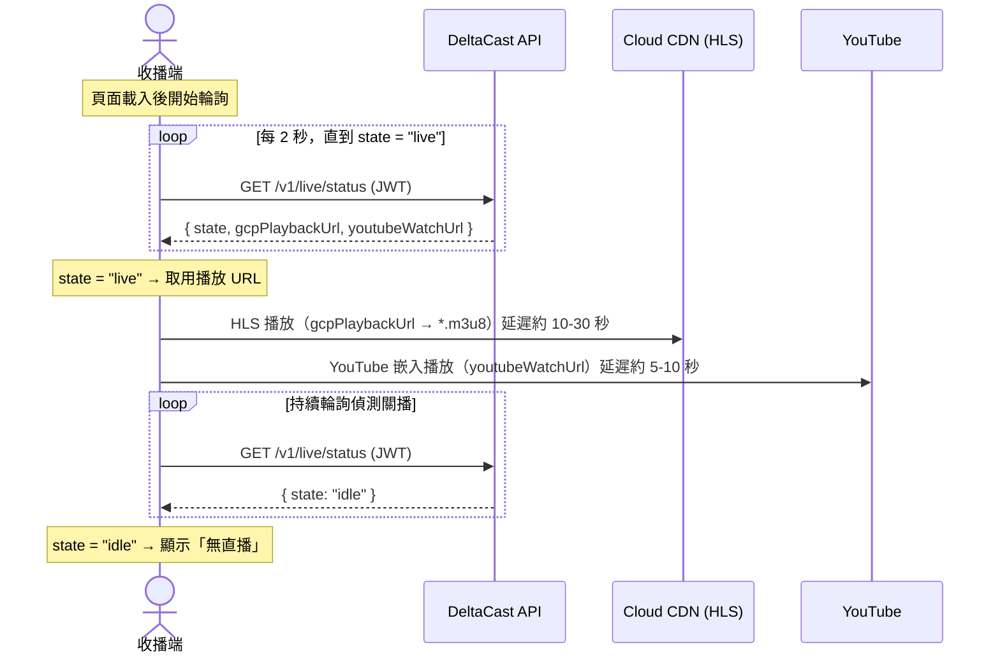
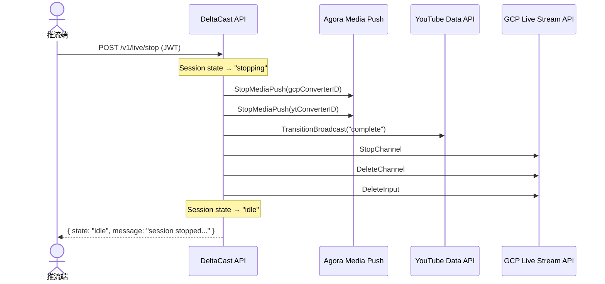
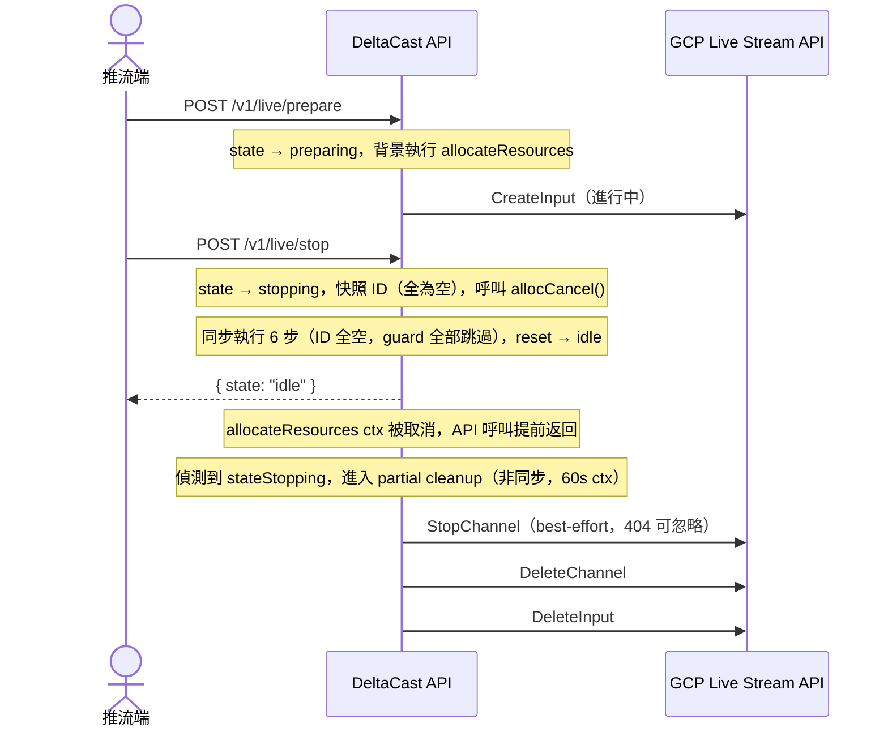

# Project Spec: DeltaCast Live Streaming Relay (2026)

## 1. 專案目標

驗證「一進多出」直播流轉發架構的可行性。直播主透過 Agora 推流至頻道，由後端（Golang）協調將流轉發（Media Push）至 YouTube 與 Google Cloud Live Stream API，最終實現跨平台（Web, YouTube, Mobile）的收視與存檔。

> **POC 限制：單一 Session，無房間概念**
> 本系統目前僅支援**單一活躍 Session**，不具備多房間或多頻道的概念。同一時間只能有一組 `prepare → start → stop` 流程在運作，前端無需也不存在「選擇房間」的邏輯。所有 API 操作均針對這唯一的全域 Session 進行。

---

## 2. 技術棧 (Tech Stack)

- **後端控制中心**: Golang (1.26+)
- **直播基礎設施**: Agora RTC SDK & Media Push (RTMP to CDN)
- **轉碼與分發**: Google Live Stream API, Google Cloud Storage (GCS), Cloud CDN
- **第三方平台**: YouTube Live Data API (RTMP Input)
- **推流端**:
  - Web: Agora Web SDK (name: `agora-rtc-sdk-ng`)
  - Mobile(N2H):
    - iOS: Agora iOS SDK (Swift)
    - Android: Agora Android SDK (Kotlin)
- **展示端**:
  - Web:
    - GCP 來源:
      - 框架: Vite + React 19 + Tailwind CSS（SPA，react-router-dom v6）
      - 播放器: video.js（直接使用，React `useRef<HTMLVideoElement>` 包裝）+ Cloud CDN HLS URL
    - YouTube 來源：react-player(優先) 或 YouTube IFrame Player API(次要)
  - Mobile(N2H):
    - iOS(Swift):
      - GCP 來源：AVPlayer (原生 HLS 支援)。
      - YouTube 來源：YouTubePlayerKit (內嵌式播放)。
    - Android(Kotlin):
      - GCP 來源：Media3 ExoPlayer (Google 官方最新推薦)。
      - YouTube 來源：android-youtube-player。

---

## 3. 系統架構與流程

後端採用 **Proxy/Orchestrator** 模式，前端不直接接觸第三方密鑰，所有指令由後端代理執行。

### 3.1 認證機制

- **層 1 — 前端存取控制**：CF Zero Trust Access 擋於網路層，未認證者無法碰到前端站點。專用 Google / GitHub OAuth + email 白名單驗證。
- **層 2 — API 認證**：所有後端 API 端點（Webhook 除外）需帶上 `Authorization: Bearer <JWT>` 標頭。JWT 使用 HS256 簽發，**必須包含 `"iss": "delta-cast"` claim**，POC 階段以固定 secret 驗證，不做使用者系統。前端透過 UI 讓使用者手動輸入長效靜態 admin JWT 並儲存至 localStorage；Token 不暴露於瀏覽器 bundle 之外，由使用者自行管理。
- **Agora Webhook**：透過 Agora 簽章驗證（Agora Notification Callback Service 簽章機制）。

### 3.2 Session 管理

- POC 階段僅支援**單一活躍 Session**，後端以 in-memory state 追蹤。
- 若已有活躍 Session，重複呼叫 `POST /v1/live/prepare` 將回傳現有 Session 資訊（不重複建立資源）。
- 若 Session 已為 `live`，重複呼叫 `POST /v1/live/start` 會回傳新 Token，不重複建立資源。
- Session 狀態機：

| 狀態        | 說明                                                                                                              |
| ----------- | ----------------------------------------------------------------------------------------------------------------- |
| `idle`      | 無活躍 Session                                                                                                    |
| `preparing` | GCP 與 YouTube 資源建立中（背景非同步，約 30-60s）                                                                |
| `ready`     | 資源就緒，播放 URL 已填入，等待推流；**5 分鐘**內未 start 則 watchdog 自動 stop                                   |
| `live`      | 串流進行中，有實際內容；每 5 分鐘 health check，連續 3 次無 converter/主播（15 分鐘）或達 4 小時硬上限則自動 stop |
| `stopping`  | 資源清理中；手動觸發、Agora NCS event 102/104 自動觸發、或 watchdog TTL 觸發                                      |

### 3.3 GCP 資源生命週期

GCP Live Stream API 的 Channel 建立需要 **30-60 秒**，為降低開播延遲，採用 **兩階段式預熱（Pre-warm）** 策略：

- **Prepare 階段**：前端呼叫 `POST /v1/live/prepare`，後端非同步建立 GCP Input + Channel 與 YouTube Broadcast。此階段耗時較長，前端可顯示「準備中」狀態。
- **Start 階段**：資源就緒後前端呼叫 `POST /v1/live/start`，後端僅需回傳 Agora Token，前端即可立即開始推流，無需等待資源分配。

資源清理：`POST /v1/live/stop` 時一併刪除 GCP Input + Channel，避免閒置計費。

### 3.4 核心時序流程

#### 開播流程

#### 收播端流程

收播端不需要呼叫 `prepare` / `start` / `stop`，只需輪詢 `GET /v1/live/status`。因為 POC 是單一 Session，不需要房間選擇邏輯。

`gcpPlaybackUrl` 與 `youtubeWatchUrl` 從 `ready` 狀態起即填入，但只有 `live` 狀態才有實際串流內容。各狀態下的欄位可用性詳見 [`doc/api/api.md`](api/api.md) 的 `GET /v1/live/status` 章節。

#### 關播流程

> **容錯**：Stop 流程每一步驟失敗只 log，不中斷後續清理，確保 GCP 資源完整釋放（GCP 按時段計費）。

#### Preparing 中途收到 Stop

`POST /v1/live/stop` 可在任意狀態下呼叫，包括仍在 `preparing` 的過程中。此時後端的處理機制如下：

1. `Stop` 設定 session state 為 `stopping`，呼叫 `allocCancel()` 取消 allocation goroutine 的 context，並快照此時所有資源 ID（preparing 階段尚未寫入，均為空字串）。
2. `Stop` 同步執行 6 個清理步驟。由於所有資源 ID 均為空，每個步驟的 guard（`if channelID != ""`）全部跳過，**Stop() 幾乎瞬間完成**，session 重設為 `idle`，回傳 `{state: "idle"}`。
3. 進行中的 GCP/YouTube API 呼叫因 context 被取消而提前返回 error，`allocateResources` goroutine 的 `wg.Wait()` 解除阻塞。
4. `allocateResources` goroutine 偵測到 `stateStopping == true`（或 `sessionID` 已變更），進入 **partial resource cleanup** 分支（非同步，在 Stop() 回傳後繼續執行）：
   - 使用全新的 60s context（原始 ctx 已被取消）
   - 嘗試 `StopChannel` → `DeleteChannel` → `DeleteInput`（若資源不存在，GCP 回 404，log 後繼續）
   - 若 YouTube broadcast 已建立，呼叫 `TransitionBroadcast("complete")`
   - 以 `if s.session.ID == sessionID` guard 防止誤覆蓋後續新建的 session

### 3.5 API 端點總覽

| Method | Path                           | 說明                                              |
| ------ | ------------------------------ | ------------------------------------------------- |
| POST   | `/v1/live/prepare`             | 預熱資源（GCP + YouTube），回傳 Session 與狀態    |
| POST   | `/v1/live/start`               | 回傳 Agora Token（不改變 Session 狀態）           |
| POST   | `/v1/live/stop`                | 關播並釋放所有資源                                |
| GET    | `/v1/live/status`              | 查詢當前 Session 狀態與播放 URL                   |
| POST   | `/v1/webhook/agora/channel`    | Agora RTC Channel NCS（無需 JWT，Agora 簽章驗證） |
| POST   | `/v1/webhook/agora/media-push` | Agora Media Push NCS（無需 JWT，Agora 簽章驗證）  |
| GET    | `/health`                      | 健康檢查（無需 JWT）                              |

詳細 request/response 規格見 [`doc/api/api.md`](api/api.md)。

---

## 4. Agora Media Push 轉碼模式設定

### 4.1 無轉碼直推模式（預設，POC 建議）

Agora Media Push 以 **raw relay** 模式運作，不對串流重新編碼，直接將 Agora 頻道的原始音視訊封包推送至 RTMP 目標（GCP 與 YouTube）。由於 GCP Live Stream API 與 YouTube 均可直接接收符合規格的 RTMP 串流，省去轉碼步驟可大幅降低 Agora 費用。

| 項目         | 說明                                                                             |
| ------------ | -------------------------------------------------------------------------------- |
| **費用**     | 僅 Agora Media Push 傳輸費，不計轉碼費用                                         |
| **前提條件** | 推流端（Agora RTC SDK）需輸出 GCP 與 YouTube 可接受的格式（H.264/AAC RTMP）      |
| **啟用方式** | 預設即為此模式，無需設定任何環境變數（`AGORA_TRANSCODING_ENABLED` 預設 `false`） |

### 4.2 轉碼模式（可選）

設定環境變數 `AGORA_TRANSCODING_ENABLED=true` 可切換為轉碼模式。Agora 會在推送前對串流執行 H.264/AAC 重新編碼，確保輸出格式標準化。適合推流端輸出格式不確定或需要統一規格的場景。

| 參數項目           | 設定值                               |
| ------------------ | ------------------------------------ |
| **編碼格式**       | H.264 (Video), AAC (Audio)           |
| **解析度**         | 1280 x 720 (720p)                    |
| **幀率 (FPS)**     | 30 fps                               |
| **碼率 (Bitrate)** | 2500 kbps (Video) + 128 kbps (Audio) |
| **關鍵幀間隔**     | 2 seconds                            |
| **啟用方式**       | `AGORA_TRANSCODING_ENABLED=true`     |

### 4.3 未來升級參考配置（1080p）

> **注意**：升級至 1080p 前，請評估 Agora Media Push 傳輸費用與 GCP Live Stream API 轉碼費用的增加，以及觀眾端頻寬需求。建議架構驗證穩定後再執行升級。

| 參數項目           | 設定值                           | 備註                              |
| ------------------ | -------------------------------- | --------------------------------- |
| **編碼格式**       | H.264 (Video), AAC (Audio)       | 不變                              |
| **解析度**         | 1920 x 1080 (1080p)              | 從 1280x720 調整                  |
| **幀率 (FPS)**     | 30 fps                           | 不變                              |
| **碼率 (Bitrate)** | 4500 - 6000 kbps                 | YouTube 官方 1080p/30fps 建議範圍 |
| **關鍵幀間隔**     | 2 seconds                        | 不變                              |
| **播放協議**       | HLS (GCP 輸出) / RTMP (轉發輸入) | 不變                              |

**升級時須同步修改的位置：**

- `server/internal/provider/agora_media_push.go`：更新轉碼模式的 `videoOptions` 解析度與碼率參數（`width`、`height`、`bitrate`）。
- `doc/spec.md`（本檔）：將 4.2 節的轉碼設定替換為 1080p 數值，並移除本節。

---

## 5. 注意事項

- **成本控管**: Google Live Stream API 是按時段計費，Stop 流程每一步驟失敗需 log 但不中斷後續清理，確保資源完整釋放。
- **Watchdog TTL（ready 狀態）**: `ready` 狀態 5 分鐘無 `start` 呼叫，後端自動執行 Stop，防止 GCP channel 閒置計費。TTL 以 sessionID 作 guard，不影響後續新 session。
- **Live Health Check（live 狀態）**: 每 5 分鐘向 Agora 查詢 converter 清單（Media Push API）與主播清單（Channel Management API）。健康條件：converter > 0 且頻道存在且主播 > 0。任一條件不滿足計一次 miss，連續 3 次（15 分鐘）觸發自動 stop。API 錯誤跳過不計 miss（避免網路抖動假陽性）。4 小時硬上限作最後防線。
- **Server 啟動 Orphan Recovery**: 啟動時非同步掃描 GCP 所有 channel，對非 `STOPPED`/`STOPPING` 狀態的 channel 執行 stop + delete，清除 crash 後殘留的孤立資源。
- **Session 單一性**: POC 階段僅支援單一活躍 Session，重複呼叫 Start 回傳現有 Session，不重複建立資源。
- **狀態簡單化**: POC 階段不處理斷線重連或複雜的併發狀態，僅以「成功連通」為驗證指標。
- **延遲預期**: HLS 預期延遲約 10-30 秒，YouTube RTMP 預期延遲約 5-10 秒。
- **認證**: 所有客戶端請求使用 JWT Bearer Token（HS256），Webhook 使用 Agora 簽章驗證。
- **Webhook 可靠性**: Agora NCS 可能重複發送事件，後端需做冪等處理（以 Session 狀態判斷是否已處理過）。
